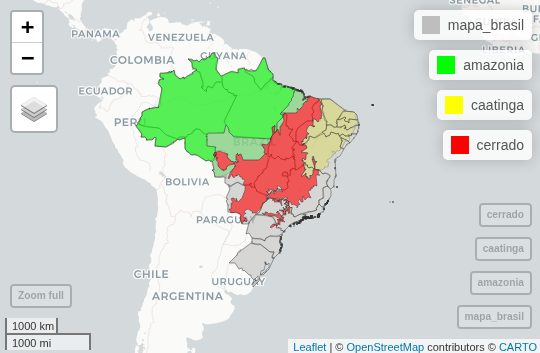

Visualização Interativa — Biomas Brasileiros (R)

Este projeto apresenta um viewer interativo dos três principais biomas brasileiros — Amazônia, Cerrado e Caatinga — desenvolvido em R, utilizando dados geográficos oficiais e bibliotecas de visualização espacial.

🗺️ Descrição

O mapa permite explorar a distribuição territorial dos biomas sobre o território nacional.
As camadas podem ser ligadas/desligadas, facilitando a comparação entre regiões.

🧩 Tecnologias Utilizadas

- R

- geobr → para obter shapefiles oficiais do IBGE

- mapview → para visualização interativa dos biomas

- sf → manipulação de dados espaciais

- dplyr → tratamento e filtragem dos dado

🧠 Aprendizados

- Obtenção de dados geográficos brasileiros com o pacote geobr.

- Manipulação de objetos espaciais (sf) e união de múltiplas camadas.

- Criação de visualizações interativas com mapview e controle de legendas.

- Compreensão da sobreposição e fronteiras entre os biomas Amazônia, Cerrado e Caatinga.
