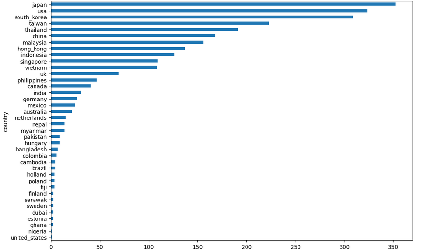
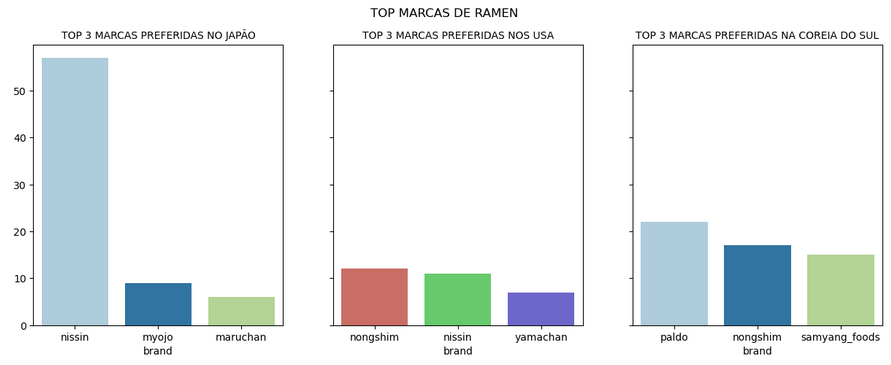
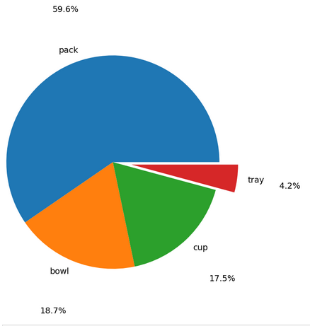

EM PRODUÇÃO!

🍜 Análise de Avaliações de Ramen Instantâneo

Este projeto tem como objetivo explorar o dataset Ramen Ratings (Kaggle), que reúne milhares de avaliações de diferentes marcas, estilos e países de ramen instantâneo.
A partir da análise, buscamos identificar padrões de consumo, qualidade e preferências regionais.

🧹 Importação e Limpeza dos Dados
🔎 Conhecendo e preparando os dados

Colunas e valores string padronizados para minúsculas e com espaços substituídos por _;

Valores não numéricos na coluna stars foram convertidos para a média das avaliações do respectivo país e marca;

Linhas com NaN em style foram excluídas por não agregarem valor à análise;

Valores NaN em top_ten foram preenchidos com 0, e ocorrências de \n substituídas também por 0;

Dataset final: 2.578 linhas e 7 colunas após a limpeza.

📊 Análise Exploratória de Dados (EDA)

🌏 Países asiáticos são líderes naturais no consumo de ramen, mas EUA e Reino Unido também se destacam.
Esse resultado reflete a globalização e a popularização da cultura oriental em países ocidentais.

🏷️ A marca Nissin apresenta a maior variedade de produtos, enquanto Indomie se destaca em qualidade, com uma pontuação média de 4.07, acima da média mundial de 3.65.

🍥 O formato “pack” é o mais popular, representando 59,6% dos produtos, seguido de bowl e cup (ambos com cerca de 18%).
Ao observar as notas, pack e bowl têm desempenho muito semelhante — 3.70 e 3.67, respectivamente — mostrando que ambos são bem aceitos pelos consumidores.

🇯🇵 Japão, 🇺🇸 EUA e 🇰🇷 Coreia do Sul são os maiores consumidores de ramen do mundo.
Dentro desses mercados, Nissin lidera no Japão e EUA, enquanto Nongshim é a marca preferida dos consumidores sul-coreanos.

Visualizações:

  
  
  
  

🧠 Conclusões

Há grande diversidade regional: Japão, EUA e Coreia do Sul dominam em consumo, mas a qualidade média das avaliações é liderada por Brasil, Sarawak (Malásia) e Camboja;

Marcas menores conseguem competir com grandes fabricantes — Indomie é exemplo disso, com as melhores avaliações médias do dataset;

O formato pack é o mais popular, mas o bowl rivaliza em pontuação, mostrando uma tendência de preferência por versões mais “premium”.

🧩 Tecnologias Utilizadas

Python

Pandas – limpeza, manipulação e agregação de dados

Seaborn / Matplotlib – visualizações e gráficos

Jupyter Notebook – documentação e execução do projeto

Dataset: [Ramen Ratings — Kaggle](https://www.kaggle.com/residentmario/ramen-ratings)
