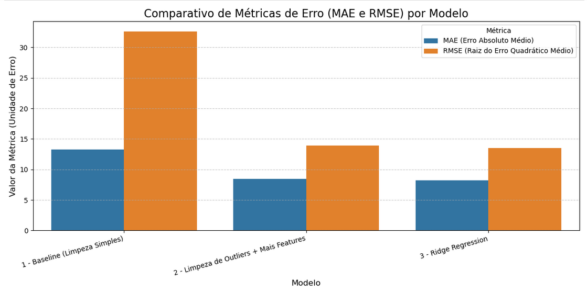

# 🍷 Wine Reviews Analysis — Price Prediction & Data Cleaning Impact

## 📌 Visão Geral

Este projeto investiga **como a qualidade do tratamento dos dados influencia diretamente o desempenho de modelos de Machine Learning**.  
Usando um dataset público de avaliações de vinhos, o objetivo foi **prever o preço** com base em características como pontuação, país, variedade e descrição textual.

O trabalho foi dividido em três versões de dados — `raw`, `clean` e `fullclean` — e três modelos de regressão, permitindo observar claramente o impacto da limpeza, enriquecimento e regularização na performance.

---

## 🧠 Objetivos

- Analisar a relação entre **preço, pontuação e origem** dos vinhos.  
- Demonstrar o efeito do **pré-processamento e engenharia de features** na melhora de performance.  
- Construir um modelo capaz de prever o preço com **baixo erro médio absoluto (MAE)**.  

---

## 🧰 Tecnologias e Bibliotecas

- **Python 3.11+**
- **pandas**, **numpy**, **matplotlib**, **seaborn**
- **scikit-learn** (LinearRegression, Ridge, DictVectorizer, train_test_split, mean_squared_error, mean_absolute_error, mutual_info_score)
- **Jupyter Notebook**

---

## 🧹 Etapas do Projeto

### Data Cleaning (Raw → Clean)

- Padronização de colunas
- Conversão de tipos e remoção de nulos  
- Eliminação de duplicatas 
- Correção de inconsistências em `country`, `region`, `variety`
- features modelo1:
   - `points`
   - `country`
   - `province`  

### Data Enrichment (Clean → FullClean)

- Imputação de valores ausentes via médias por país/variedade
- Eliminação de valores outliers extremos   
- Uso de novas features modelo 2:
  - `variety`
  - `region_1`
  - `winery`
- Tratamento de alta cardinalidade com `DictVectorizer`

### Modelagem e Avaliação

Três versões do dataset foram utilizadas para comparar desempenho e qualidade do modelo.

| Modelo | Estratégia Principal | MAE ↓ | RMSE ↓ |
|:--|:--|--:|--:|
| **1** | Baseline (Limpeza Simples) | **13.30** | **32.63** |
| **2.4** | Limpeza de Outliers + Mais Features | **8.47** | **13.93** |
| **3** | Ridge Regression (Regularização L2) | **8.24** | **13.54** |

📊 *O gráfico abaixo compara visualmente os resultados entre os três modelos:*

---

## 🧮 Avaliação do Projeto e Metodologia:

### **1️⃣ Metodologia (10/10)**

A estrutura de três modelos é um padrão-ouro em projetos de ML:

- **Baseline:** estabeleceu um ponto de referência e revelou o impacto dos outliers (RMSE muito maior que MAE).  
- **Pré-processamento aprimorado:** a remoção de outliers e a criação de novas features reduziram drasticamente o erro.  
- **Ridge Regression:** validou o uso de regularização para lidar com a alta dimensionalidade gerada pelo `DictVectorizer`.  

---

### **2️⃣ Desempenho (9.5/10)**

O desempenho final é excelente para um problema de regressão com alta cardinalidade:

- **MAE:** queda de 38% (de $13.30 → $8.24)  
- **RMSE:** queda de mais de 58% (de $32.63 → $13.54)  
- **Ridge:** trouxe estabilidade e melhor generalização.  

📈 *Erro médio de $8.24 indica que o modelo prevê o preço de um vinho com margem de erro baixa.*

---

### **3️⃣ Insights e Conclusões**

- **O pré-processamento é o verdadeiro motor do desempenho.**
- Remoção de outliers foi fundamental para melhores resultados
- Destaque para a variavel `winery` que teve maior peso nos modelos  
- **Regularização (Ridge)** foi essencial para lidar com alta cardinalidade.  
- **Limpeza e enriquecimento de dados** tiveram impacto muito maior que o tuning de hiperparâmetros.  

